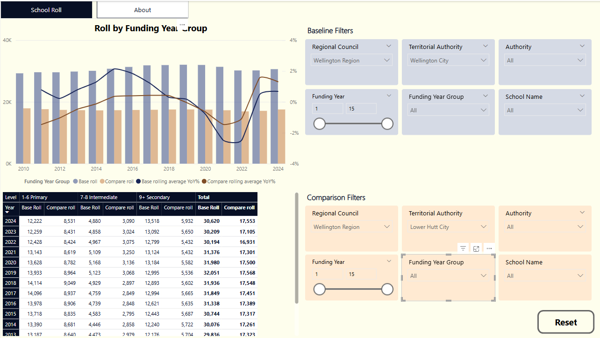

# Showcase of Power BI

This is a demonstration of what I can do in Power BI whilst training in DataCamp's [Data Analysis with Power BI career track](https://app.datacamp.com/learn/career-tracks/data-analyst-in-power-bi).

The Power BI workbook in this folder allows you to compare school roll data, setting criteria separately for baseline and comparison datasets.

Use the filters to compare two sets of school data. School data can be shown based upon a combination of:
 - Regional Council (e.g. Auckland, Wellington, etc)
 - Territorial Authority, Authority (e.g. Wellington City, Lower Hutt City, etc)
 - Authority (e.g. Private, State Integrated, State Not Integrated)
 - Funding Year
 - Funding Year Group (i.e. primary, intermediate, secondary)
 - School Name

The rolling average trend lines are based upon 3 years; last year, current year, and next year.

School details are based upon the last year that the school was reported. E.g. if a school closed in 2020, all attributes such as Regional Council etc, are a reflection as of 2020. Currently open schools reflect attributes as of 2024.

Data for this workbook was sourced from data.govt.nz, [School rolls](https://catalogue.data.govt.nz/dataset/school-rolls), Student rolls by school.

Data was converted to CSV using manual steps and code written using PySpark.
